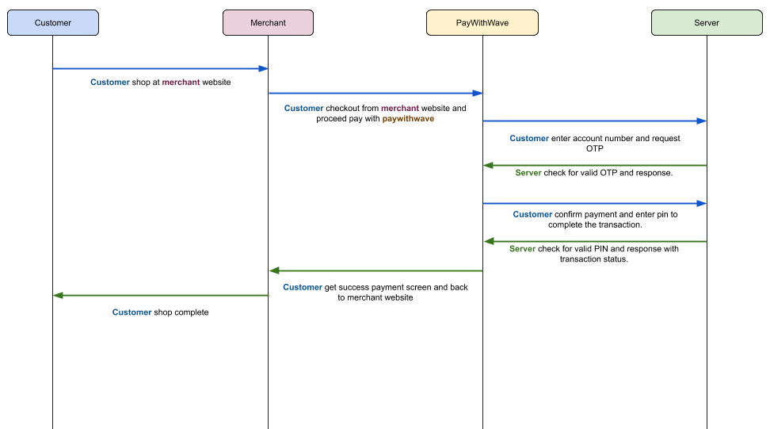

#  1. Introduction

WavePay Payment Gateway is an online payment solution by Digital Money Myanmar Limited (Wave Money) that allows online merchants to accept payments securely and instantly. 

This document covers the essential information, processes, and other relevant aspects for merchant technical integration with the Pay with Wave Platform. This document contains confidential information and is not intended to be viewed by unapproved external parties. All information and processes in the document are subject to edits and changes from Wave Money.


# 2. Technical Integration 

## 2.1 How it works

WavePay Payment Gateway allows Merchants to accept payments through the user’s WavePay account with minimum effort and enjoy the full benefits of enhanced security and full suite of payment options. Accepting payment is easier with WavePay Payment Gateway.

Below is the state diagram that explains the flow of WavePay Payment Gateway.





## 2.2 Security

Merchants who wish to have access to the API will be provided with a Client ID, Client Secret and Hash Secret Key. All Requests should carry the credentials in the API (headers) and should be over HTTPS. Certificates used for HTTPS endpoints for callback URL need to be from recognized Certificate Authorities (CAs), i.e., they are not self-signed and must be implemented with standard port 443.

## 2.2.1  Hashing Algorithm

The API is using HMAC SHA256 algorithm for the hash value between messages. The hash formula for each request & response are provided below. Please note that the null values in the message will be hash as "null" String. For example - when the transactionId is null and the hash formula is (msisdn+transactionId+merchantId) - the String to be hashed would be ```9791009039nulltestmerchantID``` (```String message = "9791009039"+"null"+"testmerchnatID"```).
There are some example snippets for the hash function for the reference. 

Javascript 
```
<script src="https://cdnjs.cloudflare.com/ajax/libs/crypto-js/3.1.9-1/crypto-js.min.js"></script>
<script src="https://cdnjs.cloudflare.com/ajax/libs/crypto-js/3.1.9-1/hmac-sha256.min.js"></script>

<script>
  var hash = CryptoJS.HmacSHA256("HelloMessage", "secret-key-1234");
  document.write(hash);
</script>
```
PHP
```
<?php

$key = 'secret-key-1234';
$message = 'HelloMessage';

// to lowercase hexits
echo(hash_hmac('sha256', $message, $key));

```


## 2.3 Environment

Merchants can use the testing environment to do their functional integrations. Once the integration testing in test environment is finished, the switch to our production system can be made. This means that all endpoints for both environments and the credentials must be obtained from Wave Money.

| **Environment** | **URL**                                      |
| --------------- | -------------------------------------------- |
| Testing         | https://testpayments.wavemoney.io:8107/payment |
| Production      | https://payments.wavemoney.io:8107/payment    |

We will be providing the Client ID and Client Secret to access both environments after successful onboarding.


## 2.4 Payment Request

 The Header of Payment Request Header will have the following content.

| **Name**              | **Description**                                  | **Type** | **Mandatory** |
| --------------------- | ------------------------------------------------ | -------- | ------------- |
| merchant_id           | Merchant ID provided by Wave Money               | string   | Mandatory     |
| order_id              | Order ID provided by Merchant                    | string   | Mandatory     |
| merchant_reference_id | Unique ID for every transaction by Merchant      | string   | Mandatory     |
| frontend_result_url   | Merchant's Website URL                           | string   | Mandatory     |
| backend_result_url    | Merchant's Web Service callback URL              | string   | Mandatory     |
| amount                | Total Amount                                     | string   | Mandatory     |
| time_to_live_in_seconds     | Time to Live for transaction (in seconds )       | string   | Mandatory     |
| payment_description   | Payment Description to display on Payment Screen | string   | Mandatory     |
| merchant_name         | Merchant Name to display on Payment Screen       | string   | Mandatory     |
| items                 | Items to display on Payment Screen               | JSON string array| Mandatory     |
| hash                  | Needed for Hash Validation                       | string   | Mandatory     |

 

# 3. How to integrate

This part of the document explains the different steps involved in integrating WavePay Payment Gateway. 


## 3.1 Setup Merchant Credentials

First, setup Merchant Credentials and Payload that are required for Request Creation

```php
$data = [
    // Time to Live for Transaction in seconds
    'time_to_live_in_seconds' => "number of seconds e.g. 5000",

    // string - Merchant Name for Payment Screen
    'merchant_name' => "<<Merchant Name e.g. MerchantX>>",

    // string - Merchant id provided by Wave Money
    'merchant_id' => "<<MerchantID>>",

    // unsigned integer - Order id provided Merchant
    'order_id' => "<<order_id e.g. 78346729>>",

    // unsigned integer - Total Amount of transaction
    'amount' => "<<amount e.g. 1000>>",

    // string - mendatory backend url for Payment Service
    'backend_result_url' => "<<Call Back URL - e.g. https://wave-merchant.com.mm/backend-callback>>",

    // string - mandatory frontend url for Payment Service
    'frontend_result_url' => "Caller URL - e.g. <<https://wave-merchant.com.mm>>",

    // string - Unique Merchant Reference ID for Transaction, reference_id is unsigned integer
    'merchant_reference_id' => "<<reference_id e.g. 8973423>>",

    // string - Payment Description for Payment Screen from Merchant
    'payment_description' => "<<Merchant Payment Description e.g. Purchase of Item X>>"
];
```

## 3.2 Setup Payment Screen Display details

Next prepare the items to display in WavePay Payment Screen.

```php
$items = json_encode([
	['name' => "Product 1", 'amount' => 1000],
	['name' => "Product 2", 'amount' => 500]
]);
```


## 3.3 Add the Secret key 
Secret Key provided by Wave Money

```php
$secret_key = "provided by WaveMoney";
```


## 3.4 Setup the hash for Payload Verification
Generate hash that is required for Payload verification.

```php
$hash = hash_hmac('sha256', implode("", [
    $data['time_to_live_in_seconds'],
    $data['merchant_id'],
    $data['order_id'],
    $data['amount'],
    $data['backend_result_url'],
    $data['merchant_reference_id'],
]), $secret_key);
```


## 3.5 Setup WavePay Payment Request
Use these Payload items and required Parameters in an HTML Form to initiate the Payment with WavePay Payment Gateway. Payment Request can be done by Ajax Request or Web Form.

### Ajax Request ( Preferred method )
```php
$client = new \GuzzleHttp\Client([
    'http_errors' => false,
    'verify' => false
]);

$response = $client->request('post', "https://testpayment.wavemoney.io:8107/payment", [
    'headers' => [
	'Accept' => "application/json",
    ],
    'form_params' => [
	"time_to_live_in_seconds" => $data['time_to_live_in_seconds'],
	"merchant_id" => $data['merchant_id'],
	"order_id" => $data['order_id'],
	"merchant_reference_id" => $data['merchant_reference_id'],
	"frontend_result_url" => $data['frontend_result_url'],
	"backend_result_url" => $data['backend_result_url'],
	"amount" => $data['amount'],
	"payment_description" => $data['payment_description'],
	"merchant_name" => $data['merchant_name'],
	"items" => $items,
	"hash" => $hash
    ]
]);
```

### Web Form
```php+HTML
<!DOCTYPE html>
<html lang="en">
<head>
    <meta charset="UTF-8">
    <meta name="viewport" content="width=device-width, initial-scale=1.0">
    <meta http-equiv="X-UA-Compatible" content="ie=edge">
    <title>Wave Merchant Integration</title>
</head>
<body>
    <form action="https://testpayment.wavemoney.io:8107/payment" method="POST">
        <input type="hidden" name="time_to_live_in_seconds" value="<?php echo $data['time_to_live_in_seconds']; ?>">
        <input type="hidden" name="merchant_id" value="<?php echo $data['merchant_id']; ?>">
        <input type="hidden" name="order_id" value="<?php echo $data['order_id']; ?>">
        <input type="hidden" name="merchant_reference_id" value="<?php echo $data['merchant_reference_id']; ?>">
        <input type="hidden" name="frontend_result_url" value="<?php echo $data['frontend_result_url']; ?>">
        <input type="hidden" name="backend_result_url" value="<?php echo $data['backend_result_url']; ?>">
        <input type="hidden" name="amount" value="<?php echo $data['amount']; ?>">
        <input type="hidden" name="payment_description" value="<?php echo $data['payment_description']; ?>">
        <input type="hidden" name="merchant_name" value="<?php echo $data['merchant_name']; ?>">
        <input type="hidden" name="items" value='<?php echo $items; ?>'>
        <input type="hidden" name="hash" value="<?php echo $hash; ?>">
        <button class="btn btn-primary">Pay with Wave</button>
    </form>
</body>
</html>
```


##  3.6 Call Back

WavePay Payment Gateway will call the Call-back URL which is the "backend_result_url" that is provided in the request form.

| HTTP Method | POST             |
| ----------- | ---------------- |
| Type        | application/json |


### Request JSON format

```json
{
  "status": "status codes as per table below",
  "merchantId": "<<MerchantID>>",
  "orderId": "<<order_id>>",
  "merchantReferenceId": "<<reference_id>>",
  "frontendResultUrl": "<<https://wave-merchant.com.mm>>",
  "backendResultUrl": "<<https://wave-merchant.com.mm/backend-callback>>",
  "initiatorMsisdn": "Myanmar Phone number - 10 digit",
  "amount": "<<amount>>",
  "timeToLiveSeconds": 300,
  "paymentDescription": "<<Merchant Payment Description e.g. Purchase of Item X>>",
  "currency": "MMK",
  "hashValue": "29e9486e727ac0e4f185c3b757cf8892e59eb8d292c23f11d13926bb0bdae798",
  "additionalField1": null,
  "additionalField2": null,
  "additionalField3": null,
  "additionalField4": null,
  "additionalField5": null,
  "transactionId": "360",
  "paymentRequestId": "360",
  "requestTime": "2019-11-06T15:38:56"  
}
```

 ### Request JSON request details 

| Property Name       | Property          | Description                                                  |
| ------------------- | ----------------- | ------------------------------------------------------------ |
| Status              | mandatory         | Please see the status codes in table below                   |
| merchantId          | mandatory         | merchant_id that will be defined and agreed on both sides    |
| orderId             | optional          | `order id` or `invoice_id` unique to the transaction generated by merchant side. there will be only one `order_id` for one order whilst there can be many `merchantReferenceId`|
| merchantReferenceId | mandatory, unique | It should be a unique string for every payment request.      |
| frontendResultUrl   | mandatory         | Web UI redirect url called after payment confirmation        |
| backendResultUrl    | mandatory         | Merchant Backend Call back url for transaction response      |
| initiatorMsisdn     | mandatory         | User/ Purchaser Msisdn (Phone Number)                        |
| amount              | mandatory         | total amount                                                 |
| timeToLiveSeconds   | mandatory         | time out amount. Limit 10 minutes                            |
| paymentDescription  | optional          | a brief title or description of the buying item. example - 3 Tuna Sandwiches |
| currency            | optional          | By default it is MMK if not provided                         |
| transactionId       | mandatory         | MFS billcollect transactionId provided by Wave               |
| paymentRequestId    | mandatory         | Payment Request id which is primary tracking id for every payment|
| requestTime         | mandatory         | now() -- serverTime                                          |
| hashValue           | mandatory         | hash_hmac(status+timeToLiveSeconds+merchantId+orderId+amount+backendResultUrl+merchantReferenceId+initiatorMsisdn+transactionId+paymentRequestId+requestTime)  -- with hash secret key |


### Request JSON request Status Codes 

|Status 			| Description   	|
|---				|---			|
|OTP_REQUESTED  		| OTP has been requested     								|
|OTP_CONFIRMED			| OTP has been verified  								|
|PAYMENT_INITIATED   		| Payment has been initiated   								|
|PAYMENT_CONFIRMED		| Payment completed successully  							|
|PAYMENT_REQUEST_CANCELLED   	| Payment has been cancelled by User/system   						|
|INVALID_HASH   		| hashValue is invalid   								|
|OTP_GENERATION_FAILED   	| OTP Generation has failed    								|
|OTP_CONFIRMATION_FAILED   	| OTP confirmation failed - Invalid or mismatch  					|
|INSUFFICIENT_BALANCE   	| Wave Account balance is insufficient or is below Invoice amount  			|
|INVALID_PIN    		| Wave Account PIN is not valid  							|
|ACCOUNT_LOCKED    		| Wave Account is locked  								|
|BILL_COLLECTION_FAILED		| Errors apart from INSUFFICIENT_BALANCE, INVALID_PIN, ACCOUNT_LOCKED 			|
|PAYMENT_CALLBACK_FAILED	| Payment callback to  backendResultUrl failed 						|
|PAYMENT_CALLBACK_SUCCESS	| Payment callback to  backendResultUrl successfull  					|
|TRANSACTION_TIMED_OUT		| Transaction has timed out when committing the payment					|
|PAYMENT_RETRIEVAL_FAILED	| Issue in retrieving payment details    						|
|MERCHANT_RETRIEVAL_FAILED	| Issue in retrieving merchant details  - Merchant not registered or activated		|


# 4. FAQs and Troubleshooting 

## As a Customer 

1. When I am at checkout/confirmation page and select “Pay with Wave Money”, do I need to enter full Wave Money Account Mobile Number? 

    - No, customer only required to enter Mobile Number prefix with ‘9’, mobile number prefix ‘0’ and country code ‘(+95)’ are not required. 

    - For e.g. 979100XXX

 

## As a Developer  

1. Is it Wave Money's responsibility for the communication between merchant client app & Merchant server app ? 
    - No. Communication between the client (merchant app) and the server (merchant server app) is the developer responsibility. 

 

2. Can I share Client_ID and Client_secret to public ? 
    - No, you should not share your Client_ID and Client_Secret to public, you must be kept secret and these details should never appear anywhere publicly, otherwise anyone could make transactions on your behalf. Wavemoney will not be held responsible for transactions not originating from your server. 

